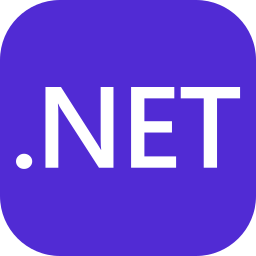
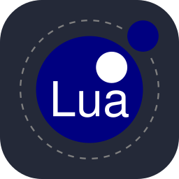
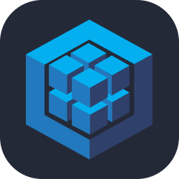
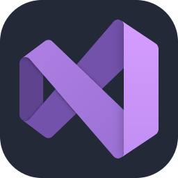
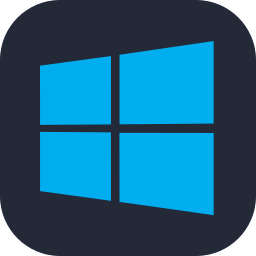

  

<h2 align="center">안녕하세요, 렉마예요.</h2>

웹 서비스를 개발하고, 취미로 게임과 작은 도구를 만들어요. 코딩, 자동차, 게임, 그리고 귀여운 것들을 좋아해요.

 

### 저에 대해

Node.js와 React로 백엔드와 프론트엔드를 개발해요. 앱·관리자·판매자 서비스처럼 서로 연결된 화면과 데이터를 다루고, 실제 사용 과정에서 생기는 문제를 고치는 일을 해요.
C#으로 Windows 프로그램과 게임 유틸리티를 만들기도 했어요. 필요한 기능을 직접 구현하거나 반복되는 작업을 자동화하는 걸 좋아해요. 요즘은 AI 코딩 도구와 로컬 LLM을 활용하는 방법을 실험하고 있어요.

### 다뤄온 기술과 도구

**웹 개발**

  
  
  
  

JavaScript · HTML · Node.js · React

**데스크톱 · 게임 · 스크립트**

  
  
  
  

C# · .NET Framework · WinForms · Lua · PowerShell · Windows 배치 스크립트 · AutoHotkey 연동

**데이터 · 서비스 연동**

  
  
  

MySQL · Sequelize · SQL Server / T-SQL · Firebase Admin / FCM · Nodemailer

**개발 환경**

  
  
  
  

Git · Visual Studio Code · Visual Studio · Windows · Hyper-V

기술을 어떤 작업에 사용했나요?

- **C# · .NET Framework · WinForms** — Windows 데스크톱 프로그램과 게임 유틸리티 제작.
- **Node.js · Firebase Admin · Nodemailer** — 푸시 알림과 메일 발송 기능.
- **SQL Server · T-SQL** — 데이터 조회와 서비스 연동.
- **PowerShell · 배치 스크립트** — 개발 작업 실행과 자동화.
- **AutoHotkey 연동** — C# 프로그램에서 입력 자동화 기능 활용.
- **React · MySQL · Sequelize** — 웹 서비스 화면, 데이터 모델과 API 작업.
- **Lua · Clockwork** — Garry’s Mod HL2RP 시스템과 UI 커스터마이징.

 

### 요즘 시간을 쓰는 곳

| 관심사 | 해보고 있는 것 |
| :--- | :--- |
| AI 코딩 | Claude Code를 활용해 반복 작업과 프로젝트 개선을 자동화하기 |
| 로컬 LLM | Ollama로 모델을 실행하고, 도구와 NPC 대화에 연결하는 방법 살펴보기 |
| 게임 만들기 | Garry’s Mod 시스템과 브라우저 리듬게임 개발하기 |
| NPC 행동 | 주변 상황과 사건에 반응하는 캐릭터 만들기 |
| UI 디자인 | 조작하기 편한 화면에 우주·몽환 분위기를 담아보기 |

### 만들면서 신경 쓰는 것

- 직접 사용하면서 버튼 위치, 글씨 크기, 피드백처럼 작은 불편도 살펴요.
- 버그가 생기면 재현 조건과 원인을 확인하고 수정하려고 해요.
- 권한 처리, 입력값 검증, 데이터의 일관성도 함께 챙겨요.
- 변경은 기능별로 나누고, 나중에 다시 봐도 이해할 수 있도록 이유를 기록해요.

 

### 코딩 밖의 취향

<table>
<tr>
<td width="50%" valign="top">
<h4>자동차와 드라이브</h4>

벨로스터 N 수동을 타요. 직접 기어를 바꾸는 재미와 차의 반응을 느끼는 걸 좋아해요.

운전뿐 아니라 정비, 타이어, 서스펜션에도 관심이 많아요. 세차와 코팅으로 차를 관리하는 것도 즐겨요.

</td>
<td width="50%" valign="top">
<h4>게임과 음악</h4>

Garry’s Mod처럼 직접 손댈 수 있는 게임, 음악과 움직임이 어우러지는 리듬게임에 관심이 있어요.

</td>
</tr>
<tr>
<td valign="top">
<h4>우주와 몽환적인 화면</h4>

별빛, 성운, 푸른빛과 보랏빛이 섞인 신비로운 분위기를 좋아해요.

마음에 드는 화면을 보면 색감, 글씨체, 배치, 움직임을 유심히 보는 편이에요.

</td>
<td valign="top">
<h4>캐릭터와 작은 디테일</h4>

귀여운 동물형 캐릭터를 좋아해요.

표정이나 포즈, 옷과 소품처럼 캐릭터의 성격이 드러나는 디테일을 보는 재미가 있어요.

</td>
</tr>
<tr>
<td valign="top">
<h4>고양이와 사진</h4>

고양이 사진이나 귀여운 밈을 보면 한참 들여다보게 돼요.

고양이 마요의 사진으로 의상과 분위기를 바꿔보는 등, 이미지로 이것저것 상상해 보는 것도 좋아해요.

</td>
<td valign="top">
<h4>하드웨어와 환경 꾸미기</h4>

PC 부품과 GPU 성능, 원격 접속 환경에도 관심이 있어요.

로컬 AI를 돌려보거나 가상 머신을 구성하면서, 가진 장비를 어떻게 활용할지 찾아보는 편이에요.

</td>
</tr>
</table>

 

  <a href="https://github.com/ReguMaster/Autopilot">요즘 만드는 것 · Autopilot</a> 
  필요한 건 만들어 보고, 좋아하는 건 조금 더 깊이 들여다봐요.

